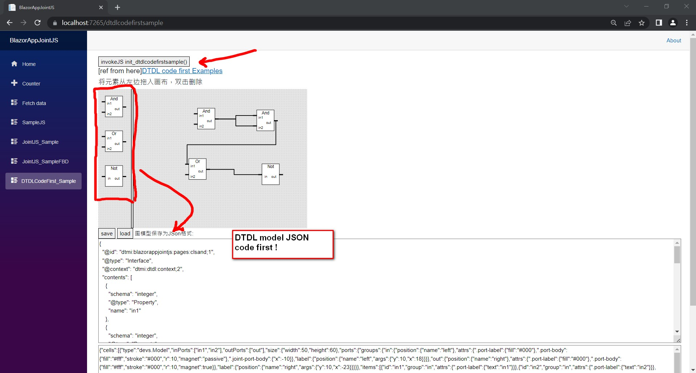
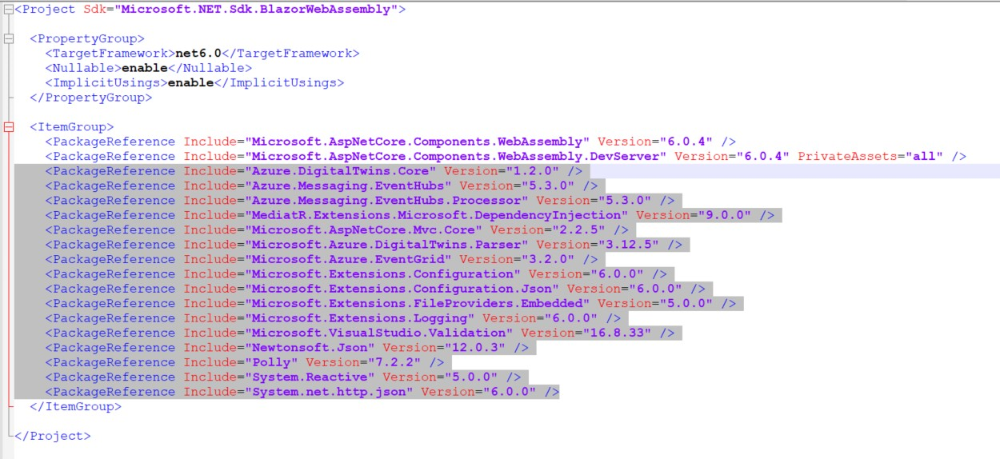

# BlazorJointJS-DTDL

Blazor component for clientIO/joint.

I am using Vs2022 and net 6 SDK.

This Blazor WASM project uses the JointJS library which could be repaid to develop Web visualization and interacts with diagrams and graphs.

- ### JointJS 

JointJS is a JavaScript diagramming library. It can be used to create either static diagrams or, and more
importantly, fully interactive diagramming tools and application builders.

Please see [http://jointjs.com](http://jointjs.com) for more information, demos and documentation.

Or check out JointJS  [mind-map documentation](https://resources.jointjs.com/mmap/joint.html).

- ### DigitalTwins-CodeFirst-dotnet

This project inspires by the [DigitalTwins-CodeFirst-Dotnet Telstra project](https://github.com/telstra/DigitalTwins-CodeFirst-dotnet).

It intends to make a better way for developers to interact with Azure Digital Twins(ADT). Telstra has developed a “code-first” approach which sees it leverage common developer Plain Old Class Objects (POCO) together with Azure Digital Twins and a new Digital Twins library that may be preferred to working with DTDL directly.

https://github.com/telstra/DigitalTwins-CodeFirst-dotnet


## Implementation JointJS with Blazor  and  DTDL

This defined as a meta model. we will Implementing all essential models in DTDL was straightforward given the capabilities of DTDL. And it demo with JointJS + telstra/DigitalTwins-CodeFirst-dotnet sample.




## Getting started

#### To make it easy for you to get started with JointJs.

- #### JointJS tutorial 

  https://resources.jointjs.com/tutorial

- #### JointJS demos

  https://resources.jointjs.com/demos/chatbot

- #### JointJS做一個簡單的功能控製圖

  http://www.bjhee.com/jointjs.html

- #### JointJS中文文檔

  https://blog.csdn.net/weixin_34168880/article/details/88678509


# Usage

## Creating vs2022 depend package with .net6 and .net5 version 

check your solution and add those PackageReference in BlazorAppJointJS.csproj.




## Creating twins models as classes

Twin models can be represented are POCO classes by deriving from the `TwinBase` class along with a `DigitalTwin` attribute. The model contents are the properties of the class and the schema is determined by the property's attribute. Any additional data can be filled in with the attribute constructor. An example is shown below.

```
[DigitalTwin(DisplayName = "Sample Twin")]
public class SampleTwin : TwinBase
{
    [TwinProperty("testProperty")]
    public string Property { get; set; }

    [TwinTelemetry]
    public bool Flag { get; set; }

    [TwinComponent]
    public SimpleTwin ComponentTwin { get; set; }

    [TwinRelationship(MaxMultiplicity = 1, MinMultiplicity = 2)]
    public TwinWithNestedObject TwinRelationship { get; set; }

    [TwinProperty]
    public List<int> IntArray { get; set; }

    [TwinProperty]
    public Dictionary<string, string> StringMap { get; set; }

}
```

The class can then be initialised as an object and used as a digital twin

## Serialisation and Deserialisation to DTDL

In order to use serialisation the ModelLibrary class must be initialised and with it a DigitalTwinSerialiser object must be created as shown below

```
var modelLibrary = new ModelLibrary();
var Serializer = new DigitalTwinSerializer(modelLibrary);
```

### Models

Model serialisation is done with the following two functions

```
Serializer.SerializeModel<T>()
Serializer.SerializeModel(Type t)
```

Both functions return the DTDL as a string. The first function takes the class type as a generic and the second takes the class type as a parameter of the `Type` class.

### Twins

Twin serialisation can be done with the following functions

```
Serializer.SerializeTwin(object twin)
Serializer.SerializeTwin<T>(T twin)
```

Both functions return the DTDL as a string however the function with the generic is a little faster.


## Add your files

- [ ] [Create](https://docs.gitlab.com/ee/user/project/repository/web_editor.html#create-a-file) or [upload](https://docs.gitlab.com/ee/user/project/repository/web_editor.html#upload-a-file) files
- [ ] [Add files using the command line](https://docs.gitlab.com/ee/gitlab-basics/add-file.html#add-a-file-using-the-command-line) or push an existing Git repository with the following command:

```
cd existing_repo
git remote add origin https://gitlab.com/minhaolee/blazorjointjs.git
git branch -M main
git push -uf origin main
```


## Contributing
The project follows a Feature Branch Workflow. So for each feature or bug a new branch must be created and all changes must be done on that branch. All commits must have a verified signature.

1. Clone the project on your local machine
2. Create a new feature/bug branch from master
3. Push the changes
4. Submit a pull request

## Authors and acknowledgment
mhlee0328@hotmail.com

## License
MIT


# References

This project is based on the Microsoft SDK recommendations outlined at https://azure.github.io/azure-sdk/dotnet_introduction.html.

The specifications for Digital Twins Definition Language version 2 (DTDLv2), are available from Microsoft under a Creative Commons (Attribution) licence at: https://github.com/Azure/opendigitaltwins-dtdl

A diagram of the structure of DTDLv2 is provided in the docs folder [docs/pics/DTDLv2-structure.png](https://github.com/telstra/DigitalTwins-CodeFirst-dotnet/blob/main/docs/pics/DTDLv2-structure.png)


Telstra/DigitalTwins-CodeFirst-dotnet at : https://github.com/telstra/DigitalTwins-CodeFirst-dotnet

minhaolee/blazorjointjs at : https://gitlab.com/minhaolee/blazorjointjs
